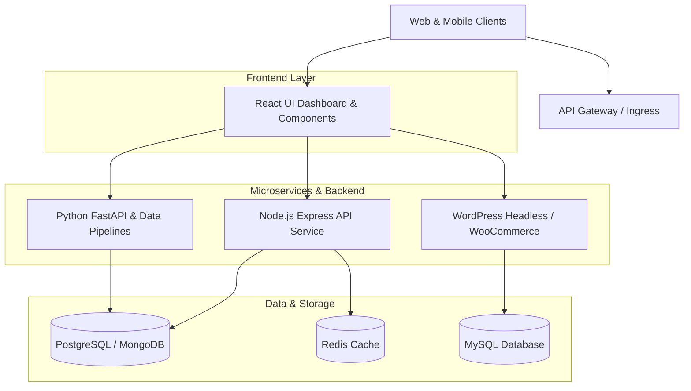

# 🚀 Developer Activity & Engineering Workspace

<div align="center">

[](https://github.com/siamdev1/my-activity/stargazers)
[](https://github.com/siamdev1/my-activity/network/members)
[](https://github.com/siamdev1/my-activity/issues)
[](https://opensource.org/licenses/MIT)
[](https://github.com/siamdev1/my-activity/actions)

<p align="center">
  <b>A production-grade, multi-stack engineering repository showcasing scalable backend microservices, modern frontend interfaces, automated data pipelines, and custom enterprise WordPress extensions.</b>
</p>

```
Node.js • Express • React • Python • FastAPI • WordPress • WooCommerce • Docker • CI/CD
```

</div>

---

## 📌 Table of Contents

- [Overview](#-overview)
- [Repository Architecture](#-repository-architecture)
- [Modules & Tech Stacks](#-modules--tech-stacks)
  - [1. Backend (Node.js / Express)](#1-backend-nodejs--express)
  - [2. Frontend (React UI Toolkit)](#2-frontend-react-ui-toolkit)
  - [3. Python Automation & Data Pipelines](#3-python-automation--data-pipelines)
  - [4. WordPress & WooCommerce Engineering](#4-wordpress--woocommerce-engineering)
- [Project Directory Layout](#-project-directory-layout)
- [Quick Start Guide](#-quick-start-guide)
- [API Documentation](#-api-documentation)
- [CI/CD & Testing](#-cicd--testing)
- [Contributing](#-contributing)
- [Author & License](#-author--license)

---

## 🌟 Overview

This repository represents the unified development ecosystem maintained by **[@siamdev1](https://github.com/siamdev1)**. It centralizes reusable microservices, full-stack components, data processing utilities, and WordPress modules engineered for high performance, modularity, and maintainability.

### Key Highlights:
- **Clean Architecture:** Domain-driven design separation across Node.js, Python, React, and PHP/WordPress layers.
- **Security-First:** Standardized JWT auth, rate-limiting middlewares, sanitized API endpoints, and CSRF protection.
- **Modern UI/UX:** React dashboard components with glassmorphism, responsive metrics, and dynamic theme switching.
- **High Concurrency:** Asynchronous data processing pipelines using Python `asyncio` and Node.js event loops.
- **Enterprise WordPress:** PSR-compliant object-oriented plugin architecture and custom REST API hooks.

---

## 🏗️ Repository Architecture



---

## 💻 Modules & Tech Stacks

### 1. Backend (Node.js / Express)
Located in [`backend-node/`](./backend-node)
- **Framework:** Express.js, Node.js runtime (v18+)
- **Features:**
  - Token-based Authentication (JWT) with refresh mechanics
  - Sliding-window Rate Limiting to prevent brute-force attacks
  - Standardized JSON responses and centralized error handling middleware
  - Winston/Morgan logging pipeline with log level configurations
  - Modular routing for user management, analytics, and health status

### 2. Frontend (React UI Toolkit)
Located in [`frontend-react/`](./frontend-react)
- **Framework:** React 18, Modern Hooks, CSS3 Custom Properties
- **Features:**
  - Responsive Activity & Analytics Dashboard
  - Interactive Git-style Activity Heatmap Component
  - Dynamic Dark / Light theme provider (`useDarkMode`)
  - Resilient API consumer custom hook (`useFetch`) with caching and retry logic
  - Glassmorphic, modern card interfaces and micro-interactions

### 3. Python Automation & Data Pipelines
Located in [`python-scripts/`](./python-scripts)
- **Frameworks:** Python 3.10+, FastAPI, Uvicorn, Requests, AsyncIO
- **Features:**
  - **FastAPI Microservice:** Asynchronous API for telemetry and background tasks
  - **Data Pipeline:** Multi-threaded ETL pipeline for scraping, normalizing, and aggregating data
  - **Web Scraper Suite:** Resilient scraper with exponential backoff, header spoofing, and proxy rotation
  - **Utility Suite:** Cryptographic hashing, timestamp formatting, and batch processors

### 4. WordPress & WooCommerce Engineering
Located in [`wordpress-dev/`](./wordpress-dev)
- **Environment:** WordPress 6.0+, PHP 8.1+, WooCommerce 8.0+
- **Features:**
  - **`siam-custom-toolkit` Plugin:** Modular plugin architecture
  - Custom REST API endpoints (`/wp-json/siam/v1/activity`)
  - Custom Post Types (Portfolio Projects, Case Studies) and custom meta boxes
  - WooCommerce Checkout customizations and dynamic pricing filters
  - Performance snippets (query optimization, asset deferral, XML-RPC hardening)

---

## 📁 Project Directory Layout

```
.
├── .github/
│   └── workflows/
│       ├── ci.yml                 # Continuous Integration Pipeline
│       └── release.yml            # Automated Release Workflow
├── backend-node/
│   ├── src/
│   │   ├── controllers/           # Request handlers (auth, user, metrics)
│   │   ├── middleware/            # Auth, RateLimiter, ErrorHandler
│   │   ├── routes/                # Express API route declarations
│   │   ├── utils/                 # Logger and JWT helper methods
│   │   └── app.js                 # Express application entry point
│   ├── package.json
│   ├── .env.example
│   └── README.md
├── frontend-react/
│   ├── src/
│   │   ├── components/            # Reusable UI components (Dashboard, Navbar, etc.)
│   │   ├── hooks/                 # Custom React hooks (useFetch, useDarkMode)
│   │   ├── styles/                # CSS design system & tokens
│   │   ├── App.jsx                # Main Dashboard View
│   │   └── index.jsx
│   ├── package.json
│   └── README.md
├── python-scripts/
│   ├── api_service/               # FastAPI microservice
│   ├── automation/                # ETL pipelines & scraper scripts
│   ├── utils/                     # Python data helper functions
│   ├── requirements.txt
│   └── README.md
├── wordpress-dev/
│   ├── plugins/
│   │   └── siam-custom-toolkit/   # Custom modular WordPress plugin
│   ├── theme-snippets/            # High-performance functions.php snippets
│   └── README.md
├── docs/
│   ├── ARCHITECTURE.md            # Detailed system design
│   ├── API_GUIDE.md               # API endpoints & payloads
│   └── DEPLOYMENT.md              # Containerization & deployment guides
├── .gitignore
├── LICENSE
└── README.md
```

---

## ⚡ Quick Start Guide

### Prerequisites
- [Node.js](https://nodejs.org/) (v18.x or newer)
- [Python](https://www.python.org/) (v3.10 or newer)
- [PHP](https://www.php.net/) (v8.1 or newer) & Composer (optional for WP development)
- [Git](https://git-scm.com/)

### 1. Clone the Repository
```bash
git clone https://github.com/siamdev1/my-activity.git
cd my-activity
```

### 2. Run Backend (Node.js)
```bash
cd backend-node
npm install
cp .env.example .env
npm run dev
# Server running at http://localhost:5000
```

### 3. Run Frontend (React)
```bash
cd ../frontend-react
npm install
npm start
# Client running at http://localhost:3000
```

### 4. Run Python Microservices & Scripts
```bash
cd ../python-scripts
python -m venv venv
# On Windows:
.\venv\Scripts\activate
# On Linux/macOS:
# source venv/bin/activate

pip install -r requirements.txt
uvicorn api_service.main:app --reload --port 8000
```

---

## 📡 API Documentation

### Node.js REST Endpoints
| Method | Endpoint | Description | Auth Required |
|---|---|---|---|
| `GET` | `/api/v1/health` | System health & uptime check | ❌ |
| `POST` | `/api/v1/auth/login` | User authentication & JWT issuance | ❌ |
| `POST` | `/api/v1/auth/register` | Register new user account | ❌ |
| `GET` | `/api/v1/users/profile` | Retrieve active user profile | ✅ |
| `GET` | `/api/v1/activity/summary`| Fetch system telemetry & activity logs | ✅ |

### Python FastAPI Endpoints
| Method | Endpoint | Description |
|---|---|---|
| `GET` | `/` | API status & microservice metadata |
| `GET` | `/api/stats` | Aggregated real-time metrics |
| `POST` | `/api/pipeline/trigger` | Trigger async ETL data pipeline |

For detailed payloads and schema definitions, please refer to [docs/API_GUIDE.md](./docs/API_GUIDE.md).

---

## 🧪 CI/CD & Testing

Automated testing is configured via **GitHub Actions** across all core modules:
- **Node.js**: Linting (`eslint`) and unit testing (`jest`).
- **Python**: PEP-8 conformance (`flake8`, `black`) and testing (`pytest`).
- **PHP**: PHP_CodeSniffer for WordPress Coding Standards (WPCS).

```bash
# Run Node tests
cd backend-node && npm test

# Run Python tests
cd python-scripts && pytest
```

---

## 🤝 Contributing

Contributions, issues, and feature requests are welcome!
1. Fork the Project
2. Create your Feature Branch (`git checkout -b feature/AmazingFeature`)
3. Commit your Changes (`git commit -m 'feat: add some amazing feature'`)
4. Push to the Branch (`git push origin feature/AmazingFeature`)
5. Open a Pull Request

---

## 👨‍💻 Author

**Siam** ([@siamdev1](https://github.com/siamdev1))
- **GitHub:** [github.com/siamdev1](https://github.com/siamdev1)
- **Stack:** Full Stack JavaScript (Node.js, React), Python, WordPress & Cloud Architecture

---

## 📄 License

This project is licensed under the MIT License - see the [LICENSE](./LICENSE) file for details.
