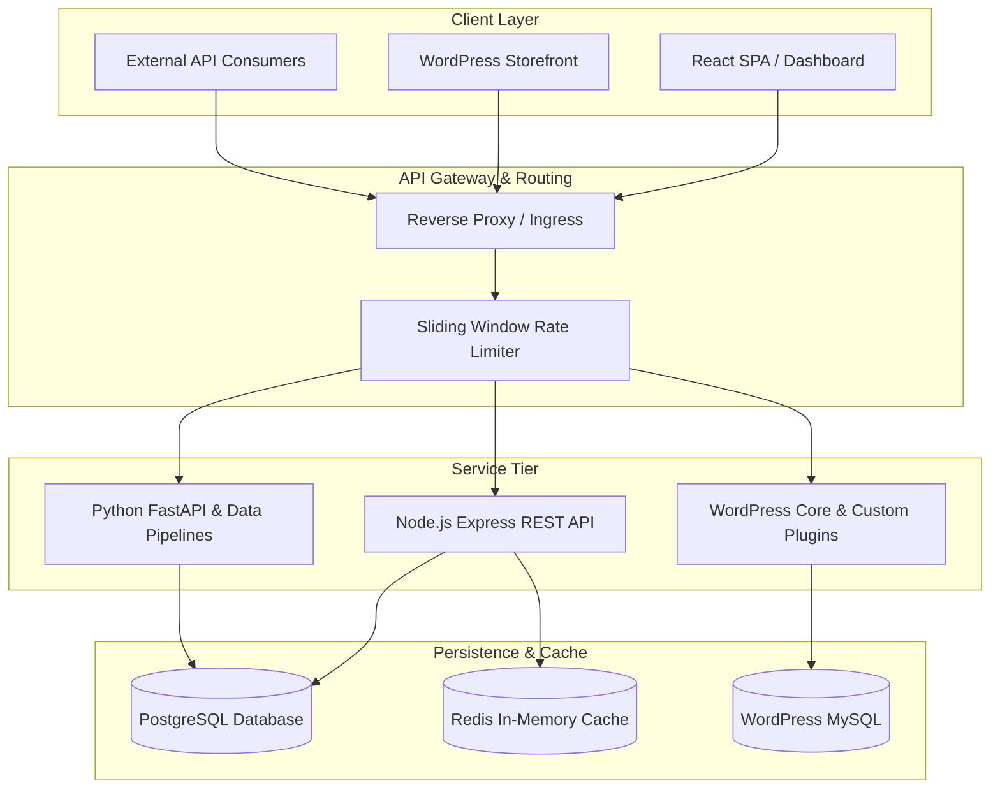

# System Architecture & Technical Specifications

## 1. System Overview

This repository is designed with modularity, scalability, and code separation principles. It bridges full-stack application development, Python-driven automation, and WordPress CMS customization into a cohesive developer workspace.

## 2. Core Modules Architecture

### 2.1 Node.js Backend Service
- **Pattern:** Layered / Controller-Service-Repository pattern.
- **Security:**
  - JWT Authentication with HMAC SHA-256 signing.
  - Helmet for secure HTTP headers.
  - Express rate limiting for abuse mitigation.
  - Standardized JSON API error schema.

### 2.2 React Frontend Architecture
- **State Management:** Custom React Context & hooks (`useDarkMode`, `useFetch`).
- **Styling Paradigm:** CSS Variables with semantic tokens for rapid theming (Dark/Light).
- **Component Hierarchy:**
  - `App` (Container & Layout)
    - `Navbar` (Header, Brand, Theme Switcher)
    - `DashboardCard` (KPI & Metrics Display)
    - `ActivityGraph` (Simulated Contribution Grid & Heatmap)

### 2.3 Python Automation & Microservices
- **FastAPI Core:** Non-blocking async endpoints for metrics aggregation.
- **ETL Data Pipeline:** Extraction from multiple sources, data cleaning, normalization, and export to JSON/CSV formats.
- **Scraper Infrastructure:** Configurable HTTP client with user-agent spoofing, header randomization, and retry handlers.

### 2.4 WordPress & WooCommerce Engineering
- **Plugin Architecture:** OOP-based modular plugin structure following WordPress Coding Standards (WPCS).
- **Extensibility:**
  - Custom REST Endpoints via `register_rest_route`.
  - Action & Filter hook integration for WooCommerce checkout.
  - Performance optimization snippets to eliminate bloat.
